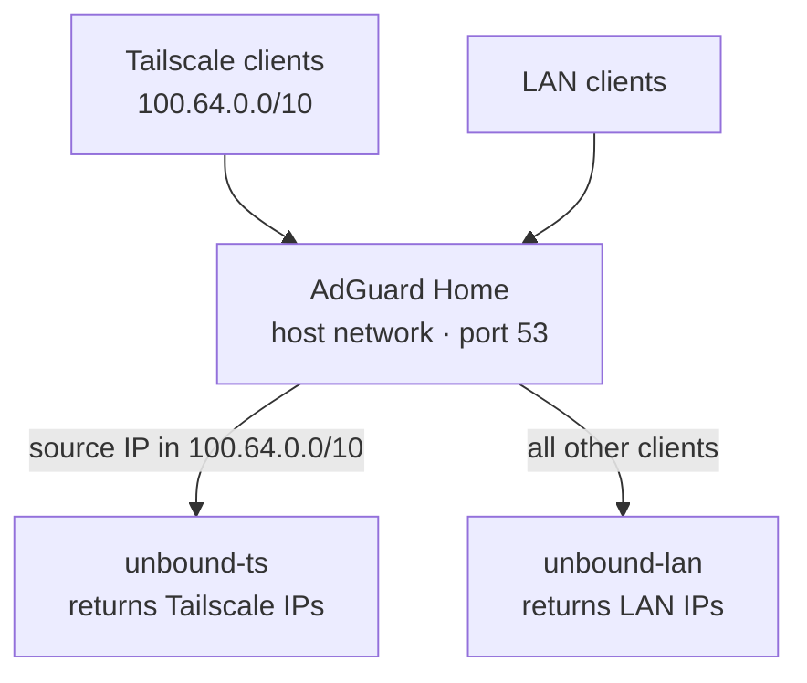

# DNS Stack

## Architecture



- **AdGuard Home** runs in `network_mode: host` so DNS queries from Tailscale clients preserve their real source IP. Without host mode, Docker's MASQUERADE rule rewrites Tailscale source IPs to the bridge gateway, breaking per-client upstream routing.
- **unbound-ts** returns Tailscale IPs for beansrn.com domains — used for Tailscale clients (`100.64.0.0/10`)
- **unbound-lan** returns LAN IPs for beansrn.com domains — used for all other clients

## AdGuard Web UI

AdGuard's web UI runs on port **3000** (changed from default 80 to avoid conflicting with Caddy).

The bind address is set in `/opt/appdata/adguard/conf/AdGuardHome.yaml`:
```yaml
http:
  address: 0.0.0.0:3000
```

It is proxied through Caddy at `ag.beansrn.com`. Direct access on port 3000 is blocked by an iptables rule.

### Block port 3000 from LAN (normal state)

```sh
sudo iptables -I INPUT -p tcp --dport 3000 -i eth0 -j DROP
sudo netfilter-persistent save
```

### Unblock port 3000 (temporary direct access)

```sh
sudo iptables -D INPUT -p tcp --dport 3000 -i eth0 -j DROP
sudo netfilter-persistent save
```

## Unbound configs

- [`unbound-lan.conf`](unbound-lan.conf) — serves LAN IPs (`192.168.1.x`), used as upstream for non-Tailscale clients
- [`unbound-ts.conf`](unbound-ts.conf) — serves Tailscale IPs (`100.x.x.x`), used as upstream for Tailscale clients (`100.64.0.0/10`)
